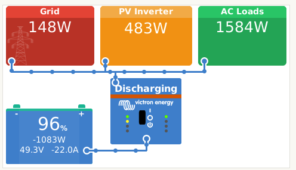
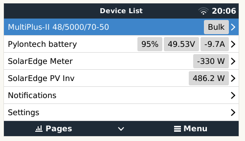
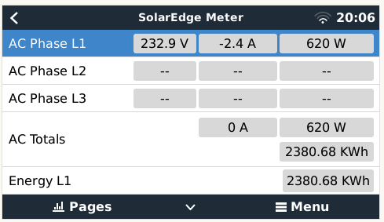

# solaredge-dbus-meter
Integrate SolarEdge meter into [Victron Energies Venus OS](https://github.com/victronenergy/venus)

**Not documented yet**. Based on https://github.com/fabian-lauer/dbus-shelly-3em-smartmeter

## Purpose
The pourpose of this software is to integrate my SolarEdge HD-Wave SE6000H with my Victron MultiPlus II without using an additional energy meter.


## How it works
### My setup
- SolarEdge HD-Wave SE6000H
- Victron MultiPlus II 50000
- Raspberry Pi 3 Model B runing Venus OS
- RS485 CAN HAT for Raspberry
- Custom 3D printed case for Raspberry + HAT + RJ45
- Pylotech batts
- modbus-proxy on docker container for multiple connections to SE inverter 

###Installation
Run following command from root shell on Venus OS:
```
/bin/bash -c "$(curl -fsSL https://raw.githubusercontent.com/zerinrc/solaredge-dbus-meter/main/installfromscratch.sh)"
```
Edit config.yml

### Pictures

 



## Install & Configuration
To be completed...


## Used documentation
- https://github.com/victronenergy/venus/wiki/dbus#grid   DBus paths for Victron namespace
- https://github.com/victronenergy/venus/wiki/dbus-api   DBus API from Victron
- https://www.victronenergy.com/live/ccgx:root_access   How to get root access on GX device/Venus OS

## Discussions on the web
This module/repository has been posted on the following threads:
- https://community.victronenergy.com/questions/125793/shelly-3em-smartmeter-with-venusos-cerbo-gx.html
